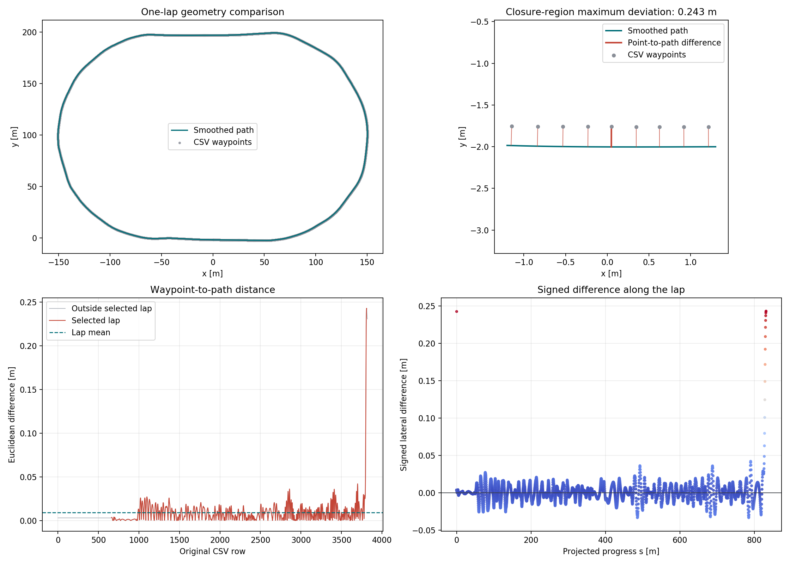
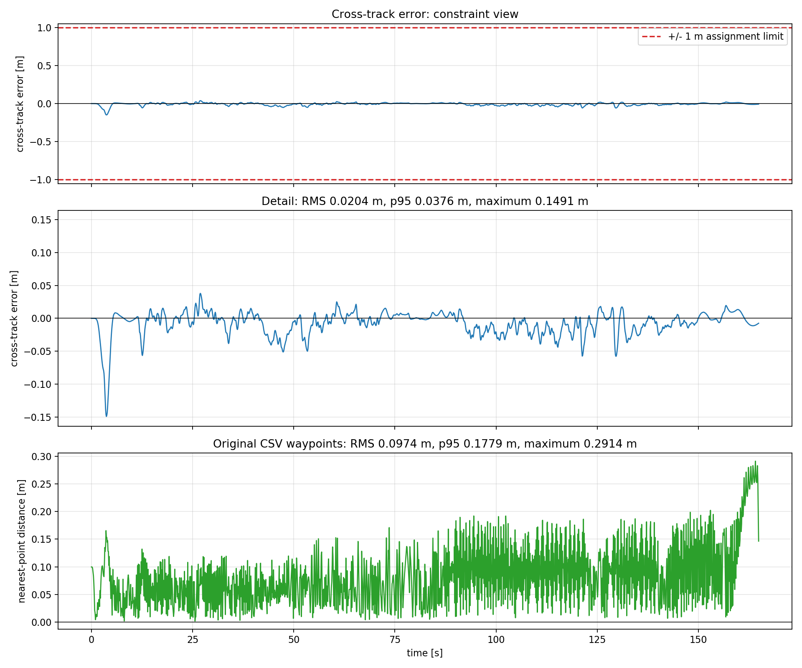
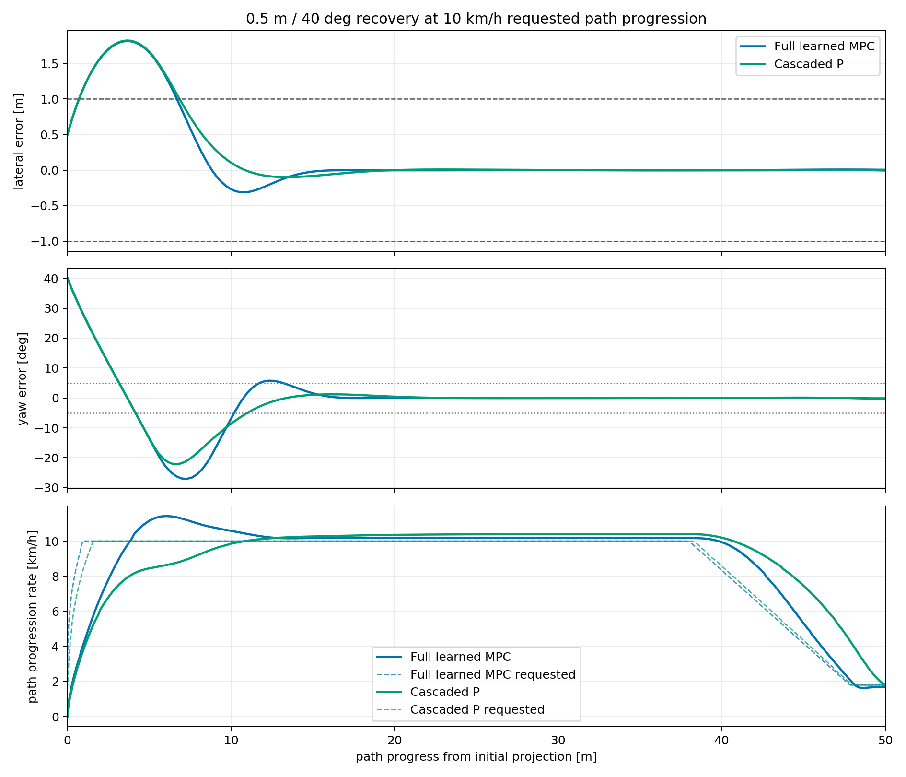

# GEM MPC Path Tracking

System identification and model predictive path tracking for the
POLARIS GEM e2 simulator.

## Assignment Coverage

| Assignment requirement | Implementation and evidence |
| --- | --- |
| Simulator data for system identification | Reproducible commissioned train, validation, and held-out test profiles in `gem_sysid` |
| Ackermann command and current state to future state model | Separate learned speed and yaw-rate residual MLPs plus midpoint Euler pose propagation |
| Model validation inputs, outputs, and RMSE | Selected-model metric table and `selected_model_test_evidence.png` below |
| MPC using the learned dynamics model | Direct-command nonlinear MPC in `gem_control` |
| CSV path execution | Simulator `package://gem_pure_pursuit_sim/waypoints/wps.csv`, converted to a closed arc-length path |
| Maximum speed `20 km/h` | Final lap: `19.660 km/h` maximum measured, `19.800 km/h` maximum command |
| Cross-track error within `1 m` | Final lap: `0.0543 m` maximum absolute smoothed-path error |
| Dockerfile and build/run instructions | Included below |
| Saved system-identification and cross-track images | Included and embedded below |
| Demonstration video | [`final_lap_demo.mp4`](results/mpc/final_lap/final_lap_demo.mp4) |

The cascaded-P controller and initial-error recovery test are additional
validation work. They are documented after the required learned-model MPC but
are not assignment requirements.

## Repository Guide

| Location | Contents |
| --- | --- |
| `catkin_ws/src/gem_sysid/` | Excitation profiles, timing commissioning, data collection, synchronization, and model training |
| `catkin_ws/src/gem_control/` | Smoothed CSV reference path, learned-model MPC, cascaded-P extension, launch files, and analysis tools |
| `catkin_ws/src/gem_control/models/selected/` | Frozen portable weights and scalers used by the MPC |
| `data/processed/` | Synchronized 10 Hz train, validation, and held-out test datasets |
| `docs/` | Detailed design decisions, equations, timing, experiments, and reproduction commands |
| `results/model_identification/` | Model comparisons, predictions, metrics, and assignment RMSE image |
| `results/reference_path/` | CSV-to-spline validation and waypoint smoothing evidence |
| `results/mpc/simulator_h12_19p5_kmh/` | Primary horizon-12 assignment-limit lap |
| `results/mpc/final_lap/` | Recorded visual demonstration, logs, metrics, and final plots |

## Development Environment

The project is developed on Windows using Docker Desktop with the WSL2
backend. ROS Noetic, Gazebo 11, and the project dependencies will run
inside an Ubuntu 20.04 Docker container.

## Run the Environment

Clone the repository together with its simulator submodule:

```bash
git clone --recurse-submodules \
  https://github.com/plenarbence/gem-mpc-path-tracking.git
cd gem-mpc-path-tracking
```

For an existing clone, initialize the simulator with:

```bash
git submodule update --init --recursive
```

Build the image:

```bash
docker compose build
```

Start the portable CPU-rendered environment:

```bash
docker compose up -d
```

On Windows with Docker Desktop, WSL2, and an NVIDIA GPU, start with the
optional GPU override:

```bash
docker compose -f docker-compose.yml -f docker-compose.gpu-wsl.yml up -d
```

Open the container desktop at
<http://localhost:6080/vnc.html?autoconnect=true&resize=scale>.

Open a shell in the running container:

```bash
docker compose exec dev bash
```

Build the ROS workspace inside that shell:

```bash
source /opt/ros/noetic/setup.bash
cd /workspace/catkin_ws
catkin build
source devel/setup.bash
```

Run `source /workspace/catkin_ws/devel/setup.bash` in every new container
shell before using `roslaunch` or `rosrun`.

Stop the environment:

```bash
docker compose down
```

The GPU override is specific to Docker Desktop's WSL2 backend. The
standard Compose file does not require an NVIDIA GPU.

## System Identification

Launch the uniform-asphalt identification simulator:

```bash
roslaunch gem_sysid sysid_sim.launch
```

Collect the Step 0 profile in a second terminal:

```bash
roslaunch gem_sysid step0_collect.launch \
  output_prefix:=/workspace/data/step0
```

Before every profile, the excitation node keeps the vehicle stopped and
commissions the 10 Hz Ackermann publication phase against all six 30 Hz lower
controller command topics. It targets a 5 ms handoff delay, returns steering to
zero, then holds the resulting phase fixed for the complete run. The measured
takeover mechanism and commissioning acceptance rules are documented in
[`docs/system_identification_notes.md`](docs/system_identification_notes.md).

Generate the deterministic identification profiles:

```bash
rosrun gem_sysid generate_identification_profiles.py
```

Collect the complete train, validation, and test suite:

```bash
rosrun gem_sysid run_identification_suite.py
```

The runner resets the vehicle, commissions the Ackermann phase, records a bag,
and produces a timing and signal-quality report for every profile. Use
`--split train` or `--profile train_speed_multistep` to collect a subset.
Profile definitions are listed in
`catkin_ws/src/gem_sysid/profiles/identification/manifest.csv`; their purpose,
split, and collection sequence are documented in
[`docs/identification_profile_suite.md`](docs/identification_profile_suite.md).

Prepare the synchronized 10 Hz datasets:

```bash
rosrun gem_sysid prepare_dataset.py
```

For each command, the synchronization anchor is its stamped publication time
plus that run's commissioned delay. Position, velocity, yaw, and yaw rate are
linearly interpolated from the odometry header timestamps to that anchor. The
generated train, validation, and test CSV files are written to
`data/processed/`. Exact timestamp equations, fields, and interpolation rules
are in [`docs/data_preparation.md`](docs/data_preparation.md).

Raw ROS bags are intentionally excluded from Git because they are large
runtime captures. The deterministic profile definitions and collection runner
recreate them, while the processed train/validation/test CSVs required to
reproduce model training are included in the repository.

Compare Euler and midpoint Euler pose integration on the long test profile:

```bash
rosrun gem_sysid compare_integration_methods.py
```

This comparison uses only odometry longitudinal speed and odometry yaw rate.
Results are written to
`results/model_identification/integration_comparison/`; the equations and
comparison metrics are in
[`docs/integration_comparison.md`](docs/integration_comparison.md).

Train and evaluate the neural identification grid:

```bash
rosrun gem_sysid run_neural_identification.py
```

The grid trains separate residual MLPs for speed and yaw rate using three input
histories, three objectives, and three deterministic seeds. Candidate selection
uses train and validation data only. The selected checkpoint is evaluated once
on the held-out test profile. PyTorch checkpoints and portable JSON weights
are written below `results/model_identification/neural_experiments/`.

The learned state is longitudinal speed \(v\) and yaw rate \(\omega\). For

\[
z_k=[v_k,\omega_k,v_{\mathrm{cmd},k},\delta_{\mathrm{cmd},k}],
\]

two independent residual networks predict

\[
v_{k+1}=v_k+f(z_k,z_{k-1},z_{k-2}),\qquad
\omega_{k+1}=\omega_k+g(z_k,z_{k-1},z_{k-2}).
\]

Position and yaw are propagated with midpoint Euler. The selected model uses
two 32-unit `tanh` layers in each network and was chosen from 27 neural runs
using validation RMSE only.

| Selected-model metric | Validation | Test |
| --- | ---: | ---: |
| One-step speed RMSE | 0.003201 m/s | 0.004015 m/s |
| One-step yaw-rate RMSE | 0.001513 rad/s | 0.003046 rad/s |
| One-step XY RMSE | 0.000206 m | 0.000253 m |
| One-step yaw RMSE | 0.000111 rad | 0.000202 rad |
| Recursive 20-step XY RMSE | 0.047471 m | 0.054778 m |
| Recursive 20-step yaw RMSE | 0.012369 rad | 0.009451 rad |


The detailed method, experiment comparison, prediction CSVs, and portable
inference contract are documented in
[`docs/neural_identification.md`](docs/neural_identification.md).

## Reference Path

Build and validate the closed, arc-length-parameterized path:

```bash
rosrun gem_control validate_reference_path.py
```

The `gem_control` package resolves
`package://gem_pure_pursuit_sim/waypoints/wps.csv` through ROS, removes the
stationary prefix and duplicates, extracts one lap, closes its endpoint, and
fits the validated periodic smoothing spline. It provides both a numerical
Python path for vehicle projection and a differentiable CasADi path for MPC.
Validation evidence is written to `results/reference_path/`; the method and
interface are documented in
[`docs/reference_path.md`](docs/reference_path.md).



## Full Learned MPC

Benchmark the direct-command nonlinear MPC:

```bash
rosrun gem_control benchmark_full_mpc.py
```

The controller uses the frozen selected H2 neural model, direct Ackermann speed
and steering decisions, midpoint Euler pose propagation, and the documented
tuned path-tracking costs. Its causal timing preparation aligns pre-publication
odometry to the commissioned `+5 ms` application anchor and predicts one
controller period ahead before optimization.

At each prediction stage, the objective is

\[
8e_y^2 + 28.2682787(1-\cos(e_\psi))
+2.4(\dot{s}-\dot{s}_{ref})^2
+0.25908285(\Delta\delta/0.06)^2
+0.2061432(\Delta v_{cmd}/0.2)^2.
\]

The learned dynamics and orthogonal path projection are equality constraints.
Path progress is monotonic, speed commands are constrained to `0..5.5 m/s`,
steering commands to `-0.3..0.3 rad`, and predicted speed and yaw rate remain
inside the identified operating domain. The shifted previous solution is used
as the next command warm start; states are re-rolled causally from the latest
delay-compensated measurement. Runtime parameters and weights are in
[`full_mpc.yaml`](catkin_ws/src/gem_control/config/full_mpc.yaml).

Horizon 12 is the default: all 20 offline operational solves passed with
`66.8 ms` complete-computation p95. Horizon 15 exceeded the `80 ms` criterion.
For this controller, the legacy `reference_speed_mps` launch argument is the
requested path-progression rate, not a vehicle-speed reference.

Run the final guarded lap with Gazebo and the project RViz view:

```bash
roslaunch gem_control full_mpc_sim.launch \
  gui:=true use_rviz:=true \
  reference_speed_mps:=5.4166666667 target_laps:=1.0 \
  output_directory:=/workspace/results/mpc/simulator_h12_19p5_kmh
```

RViz displays the closed CSV reference on
`/gem_control/reference_path` and the driven progress on
`/gem_control/vehicle_path`. Both use the ground-truth odometry frame.

After the controller stops, generate the result plots:

```bash
rosrun gem_control analyze_full_mpc_run.py \
  /workspace/results/mpc/simulator_h12_19p5_kmh
```

The final horizon-12 lap used a `19.5 km/h` requested path progression and
travelled `831.68 m` with `0.00776 m` lateral RMS error and `0.05426 m`
maximum error. All 1,648 solves were accepted; complete MPC computation was
`36.63 ms` p95 and `76.71 ms` maximum with no `80 ms` deadline miss. Horizon
10 was therefore not required. Maximum measured vehicle speed was
`19.660 km/h`, and maximum Ackermann speed command was `19.800 km/h`, so the
assignment's `20 km/h` limit was respected. Implementation details, limits,
warm starts, deadline handling, and evidence are documented in
[`docs/full_learned_mpc.md`](docs/full_learned_mpc.md).

The third panel reports unsigned vehicle distance to the nearest original CSV
waypoint; the first two panels retain the signed smoothed-path error.


For the recorded demonstration, use the dedicated visual-world wrapper:

```bash
roslaunch gem_control final_lap_demo.launch

rosrun gem_control analyze_full_mpc_run.py \
  /workspace/results/mpc/final_lap
```

This wrapper opens the original road world, Gazebo, and RViz and writes to
`results/mpc/final_lap/`. It uses an 8-step horizon because simultaneous
Gazebo, RViz, noVNC, and screen recording made the 10-step visual run exceed
the `80 ms` budget three times consecutively. The learned model, objective,
constraints, 10 Hz controller period, and commissioned timing are unchanged.

The recorded run completed `1.0000` lap. Its smoothed-path lateral error was
`0.02036 m` RMS and `0.14911 m` maximum. Maximum measured speed was
`19.803 km/h`, and maximum command was `19.800 km/h`. Complete computation was
`40.29 ms` mean and `65.98 ms` p95. Three isolated deadline misses held the
previous feasible command and did not interrupt the lap.



## Extra Controller: Cascaded P

The separate cascaded-P baseline uses fixed, previously tuned gains and no
learned model or optimizer. It intentionally buffers each command for one 100 ms
control step without state prediction. The same commissioning, path,
visualization, safety checks, logging, and stopping behavior are retained.

Run its validated 19.5 km/h lap with:

```bash
roslaunch gem_control cascaded_p_sim.launch \
  gui:=true use_rviz:=true \
  reference_speed_mps:=5.4166666667 target_laps:=1.0 \
  output_directory:=/workspace/results/cascaded_p/simulator_19p5_kmh
```

The completed lap achieved `0.0812 m` RMS and `0.2971 m` maximum absolute
lateral error, while the maximum measured speed remained `19.76 km/h`.
Implementation, timing, and validation details are in
[`docs/cascaded_p.md`](docs/cascaded_p.md).


## Extra Validation: Initial-Error Stress Test

The full learned MPC and cascaded P were also run from the same `0.5 m`
lateral and `+40 deg` yaw error at a `10 km/h` reference path progression for
a `50 m` target. The scenario is isolated in `initial_error_test.launch`, and
every run performs its own timing commissioning.

The full learned MPC and cascaded P completed the target and met the defined
settling condition after `13.75 m` and `11.11 m`, respectively. Both
controllers temporarily exceeded `1 m` lateral error, so this is a robustness
comparison rather than a passing assignment-limit run. The comparison uses
measured path-progression rate, not vehicle speed, against the requested
progression.

Commands, exact metrics, and interpretation are documented in
[`docs/initial_error_recovery.md`](docs/initial_error_recovery.md).



## Demonstration Video

The completed demonstration is
[`results/mpc/final_lap/final_lap_demo.mp4`](results/mpc/final_lap/final_lap_demo.mp4).
It starts `final_lap_demo.launch` from a terminal, shows the reference and
vehicle progress in RViz, shows the vehicle completing the road in Gazebo, and
ends with:

1. The held-out system-identification inputs, measured/predicted outputs, and
   RMSE image.
2. The final cross-track error over time with the assignment's `+/-1 m` limit.

The compressed H.264/AAC recording is `1920x1146`, `30 FPS`, `5:14`, and
approximately `78 MB`.

## Status

Docker environment, GEM simulator, uniform identification world, reusable CSV
excitation, timing commissioning, Step 0 analysis, and the complete
identification profile suite, synchronized datasets, and neural dynamics
identification experiment are implemented. The system-identification stage and
the shared smoothed reference-path layer are complete. The offline full learned
MPC core, delayed-state preparation, warm start, horizon selection, guarded ROS
execution, solver deadline handling, and closed-loop Gazebo validation are
implemented. The cascaded-P extension is implemented and validated as a
separate controller. All assignment code, evidence images, and the
demonstration video are included in this repository.
