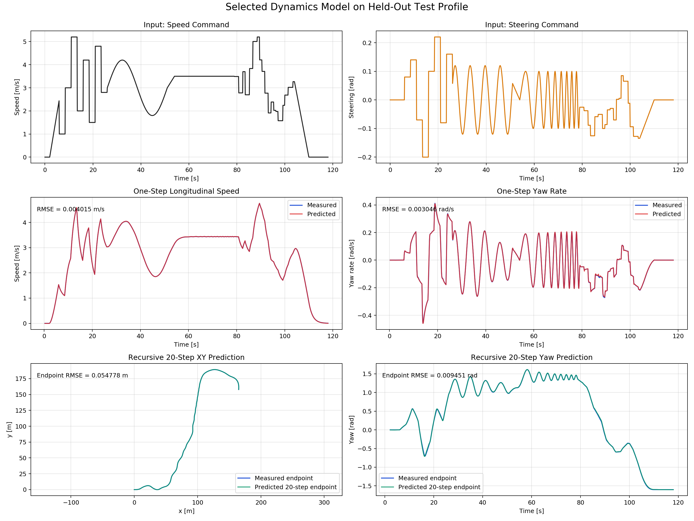
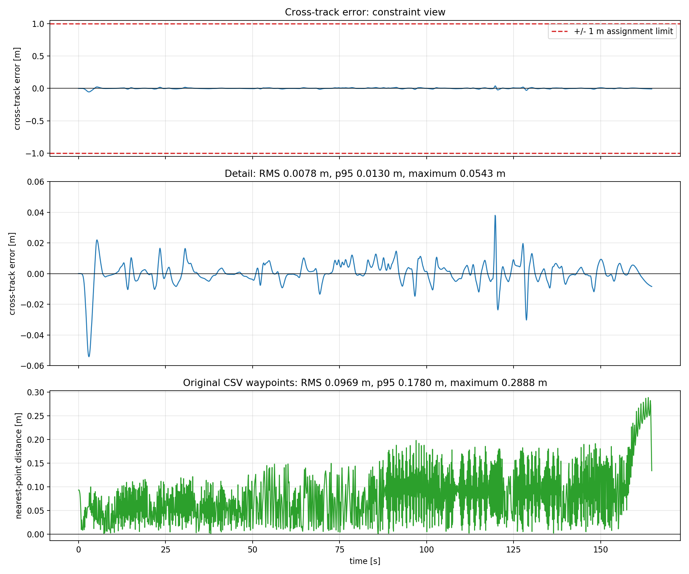
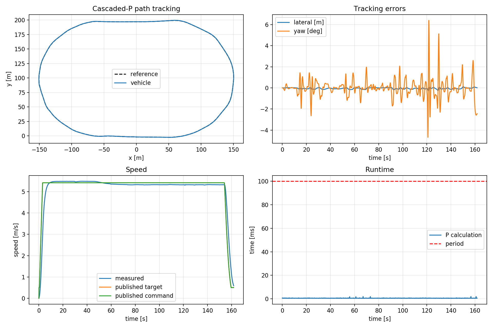
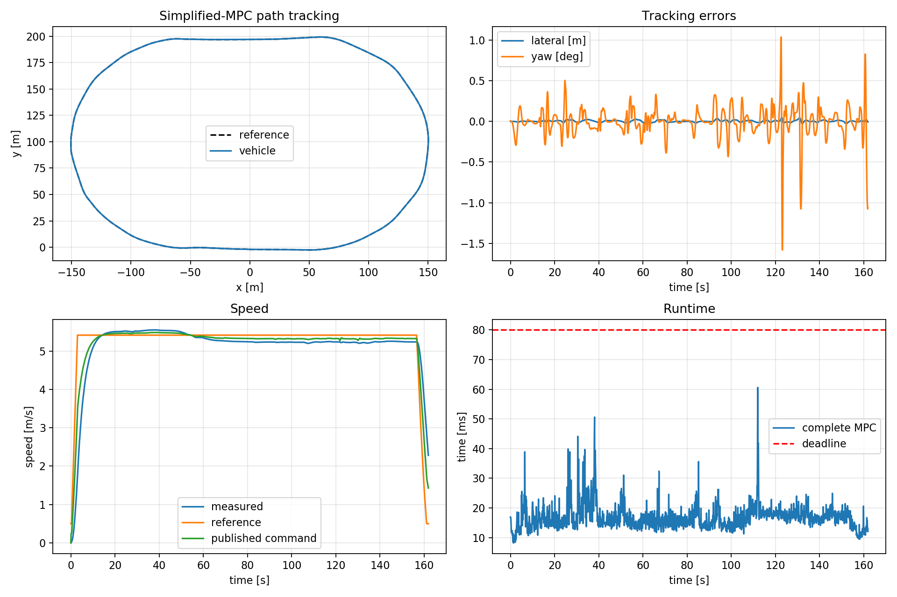

# GEM MPC Path Tracking

System identification and model predictive path tracking for the
POLARIS GEM e2 simulator.

## Development Environment

The project is developed on Windows using Docker Desktop with the WSL2
backend. ROS Noetic, Gazebo 11, and the project dependencies will run
inside an Ubuntu 20.04 Docker container.

## Run the Environment

Build the image:

```bash
docker compose build
```

Start the portable CPU-rendered environment:

```bash
docker compose up -d
```

On Windows with Docker Desktop, WSL2, and an NVIDIA GPU, start with the
optional GPU override:

```bash
docker compose -f docker-compose.yml -f docker-compose.gpu-wsl.yml up -d
```

Open the container desktop at
<http://localhost:6080/vnc.html?autoconnect=true&resize=scale>.

Open a shell in the running container:

```bash
docker compose exec dev bash
```

Build the ROS workspace inside that shell:

```bash
source /opt/ros/noetic/setup.bash
cd /workspace/catkin_ws
catkin build
source devel/setup.bash
```

Run `source /workspace/catkin_ws/devel/setup.bash` in every new container
shell before using `roslaunch` or `rosrun`.

Stop the environment:

```bash
docker compose down
```

The GPU override is specific to Docker Desktop's WSL2 backend. The
standard Compose file does not require an NVIDIA GPU.

## System Identification

Launch the uniform-asphalt identification simulator:

```bash
roslaunch gem_sysid sysid_sim.launch
```

Collect the Step 0 profile in a second terminal:

```bash
roslaunch gem_sysid step0_collect.launch \
  output_prefix:=/workspace/data/step0
```

Before every profile, the excitation node keeps the vehicle stopped and
commissions the 10 Hz Ackermann publication phase against all six 30 Hz lower
controller command topics. It targets a 5 ms handoff delay, returns steering to
zero, then holds the resulting phase fixed for the complete run.

Generate the deterministic identification profiles:

```bash
rosrun gem_sysid generate_identification_profiles.py
```

Collect the complete train, validation, and test suite:

```bash
rosrun gem_sysid run_identification_suite.py
```

The runner resets the vehicle, commissions the Ackermann phase, records a bag,
and produces a timing and signal-quality report for every profile. Use
`--split train` or `--profile train_speed_multistep` to collect a subset.
Profile definitions are listed in
`catkin_ws/src/gem_sysid/profiles/identification/manifest.csv`.

Prepare the synchronized 10 Hz datasets:

```bash
rosrun gem_sysid prepare_dataset.py
```

For each command, the synchronization anchor is its stamped publication time
plus that run's commissioned delay. Position, velocity, yaw, and yaw rate are
linearly interpolated from the odometry header timestamps to that anchor. The
generated train, validation, and test CSV files are written to
`data/processed/`.

Compare Euler and midpoint Euler pose integration on the long test profile:

```bash
rosrun gem_sysid compare_integration_methods.py
```

This comparison uses only odometry longitudinal speed and odometry yaw rate.
Results are written to
`results/model_identification/integration_comparison/`.

Train and evaluate the neural identification grid:

```bash
rosrun gem_sysid run_neural_identification.py
```

The grid trains separate residual MLPs for speed and yaw rate using three input
histories, three objectives, and three deterministic seeds. Candidate selection
uses train and validation data only. The selected checkpoint is evaluated once
on the held-out test profile. PyTorch checkpoints and portable JSON weights
are written below `results/model_identification/neural_experiments/`.

The learned state is longitudinal speed \(v\) and yaw rate \(\omega\). For

\[
z_k=[v_k,\omega_k,v_{\mathrm{cmd},k},\delta_{\mathrm{cmd},k}],
\]

two independent residual networks predict

\[
v_{k+1}=v_k+f(z_k,z_{k-1},z_{k-2}),\qquad
\omega_{k+1}=\omega_k+g(z_k,z_{k-1},z_{k-2}).
\]

Position and yaw are propagated with midpoint Euler. The selected model uses
two 32-unit `tanh` layers in each network and was chosen from 27 neural runs
using validation RMSE only.

| Selected-model metric | Validation | Test |
| --- | ---: | ---: |
| One-step speed RMSE | 0.003201 m/s | 0.004015 m/s |
| One-step yaw-rate RMSE | 0.001513 rad/s | 0.003046 rad/s |
| One-step XY RMSE | 0.000206 m | 0.000253 m |
| One-step yaw RMSE | 0.000111 rad | 0.000202 rad |
| Recursive 20-step XY RMSE | 0.047471 m | 0.054778 m |
| Recursive 20-step yaw RMSE | 0.012369 rad | 0.009451 rad |



The detailed method, experiment comparison, prediction CSVs, and portable
inference contract are documented in
[`docs/neural_identification.md`](docs/neural_identification.md).

## Reference Path

Build and validate the closed, arc-length-parameterized path:

```bash
rosrun gem_control validate_reference_path.py
```

The `gem_control` package resolves the simulator waypoint CSV through ROS,
removes the stationary prefix and duplicates, extracts one lap, closes its
endpoint, and fits the validated periodic smoothing spline. It provides both a
numerical Python path for vehicle projection and a differentiable CasADi path
for MPC. Validation evidence is written to `results/reference_path/`; the
method and interface are documented in
[`docs/reference_path.md`](docs/reference_path.md).

## Full Learned MPC

Benchmark the direct-command nonlinear MPC:

```bash
rosrun gem_control benchmark_full_mpc.py
```

The controller uses the frozen selected H2 neural model, direct Ackermann speed
and steering decisions, midpoint Euler pose propagation, and the tuned path
tracking costs from `v1`. Its causal timing preparation aligns pre-publication
odometry to the commissioned `+5 ms` application anchor and predicts one
controller period ahead before optimization.

Horizon 12 is the default: all 20 offline operational solves passed with
`66.8 ms` complete-computation p95. Horizon 15 exceeded the `80 ms` criterion.

Run the final guarded lap with Gazebo and the project RViz view:

```bash
roslaunch gem_control full_mpc_sim.launch \
  gui:=true use_rviz:=true \
  reference_speed_mps:=5.4166666667 target_laps:=1.0 \
  output_directory:=/workspace/results/mpc/simulator_h12_19p5_kmh
```

RViz displays the closed CSV reference on
`/gem_control/reference_path` and the driven progress on
`/gem_control/vehicle_path`. Both use the ground-truth odometry frame.

After the controller stops, generate the result plots:

```bash
rosrun gem_control analyze_full_mpc_run.py \
  /workspace/results/mpc/simulator_h12_19p5_kmh
```

The final horizon-12 lap ran at `19.5 km/h` and travelled `831.68 m` with
`0.00776 m` lateral RMS error and `0.05426 m` maximum error. All 1,648 solves
were accepted; complete MPC computation was `36.63 ms` p95 and `76.71 ms`
maximum with no `80 ms` deadline miss. Horizon 10 was therefore not required.
Implementation details, limits, warm starts, deadline handling, and evidence
are documented in
[`docs/full_learned_mpc.md`](docs/full_learned_mpc.md).

The third panel reports unsigned vehicle distance to the nearest original CSV
waypoint; the first two panels retain the signed smoothed-path error.



## Extra Controller: Cascaded P

The separate cascaded-P baseline uses the frozen `v1` gains and no learned
model or optimizer. It intentionally buffers each command for one 100 ms
control step without state prediction. The same commissioning, path,
visualization, safety checks, logging, and stopping behavior are retained.

Run its validated 19.5 km/h lap with:

```bash
roslaunch gem_control cascaded_p_sim.launch \
  gui:=true use_rviz:=true \
  reference_speed_mps:=5.4166666667 target_laps:=1.0 \
  output_directory:=/workspace/results/cascaded_p/simulator_19p5_kmh
```

The completed lap achieved `0.0812 m` RMS and `0.2971 m` maximum absolute
lateral error, while the maximum measured speed remained `19.76 km/h`.
Implementation, timing, and validation details are in
[`docs/cascaded_p.md`](docs/cascaded_p.md).



## Extra Controller: Simplified MPC

The separate simplified hierarchical MPC optimizes speed-state and yaw
increments with a 12-step, 1.2 s kinematic horizon. A lower yaw-P conversion
produces the steering command with a `+/-0.5 rad` limit. The selected H2 neural
model is used only for one causal delay-prediction step before optimization,
not inside the horizon.

Run the validated requested 19.5 km/h lap with:

```bash
roslaunch gem_control simplified_mpc_sim.launch \
  gui:=true use_rviz:=true \
  reference_speed_mps:=5.4166666667 target_laps:=1.0 \
  output_directory:=/workspace/results/simplified_mpc/simulator_h12_19p5_kmh
```

The completed lap achieved `0.0122 m` RMS and `0.0529 m` maximum absolute
lateral error. All 1,620 solves were accepted; complete calculation was
`23.60 ms` p95 and `60.60 ms` maximum, with no `80 ms` deadline misses.
After startup, measured speed averaged `19.16 km/h` and stayed between
`18.34` and `19.99 km/h`. The normalized `Delta v` penalty was reduced from
the frozen `4.0` value to `0.05` after partial-run validation. Details are in
[`docs/simplified_mpc.md`](docs/simplified_mpc.md).



## Status

Docker environment, GEM simulator, uniform identification world, reusable CSV
excitation, timing commissioning, Step 0 analysis, and the complete
identification profile suite, synchronized datasets, and neural dynamics
identification experiment are implemented. The system-identification stage and
the shared smoothed reference-path layer are complete. The offline full learned
MPC core, delayed-state preparation, warm start, horizon selection, guarded ROS
execution, solver deadline handling, and closed-loop Gazebo validation are
implemented. The cascaded-P and simplified hierarchical-MPC extensions are
implemented and validated as separate controllers.
